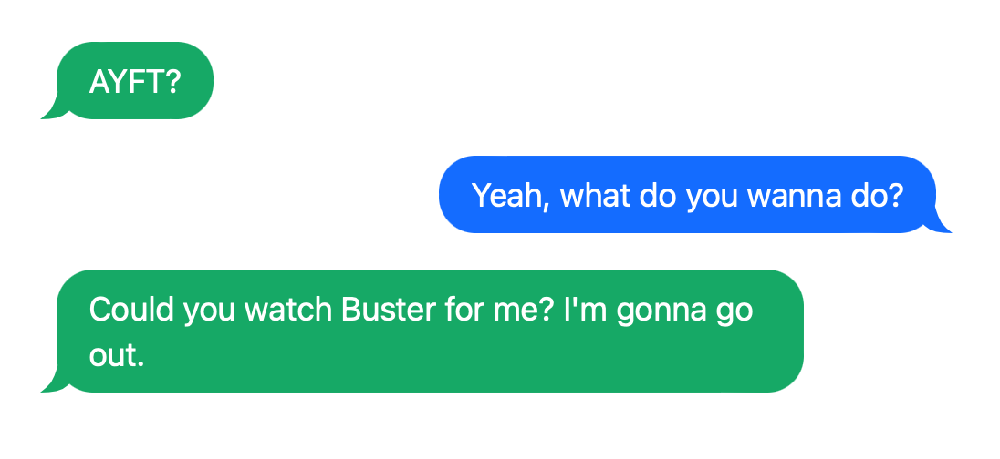

# messages-css

Style for message block (as in the messenger):

CSS code for doing message interaction on the HTML page. Copied from the other site.

(c) the Internet-site https://slang.net/meaning/ayft file styles.

See all the files at the project, to view the meaning (all *.css and *.html):
- the css-misc.css,
- the message-blocks-interactive.css (a part of the style's file, which is taken from the site),
- file.html as a whole HTML mentioned on the site via the F12 at the elements (contains part with HTML with message block, see pic *A* further).

Example of the result (the [site](https://slang.net/meaning/ayft)'s part, a screenshot):

<!--  -->

<figure>

<figcaption>A</figcaption>
</figure>

Addition: a text may be copied from the page with the picture, styled in this way.
